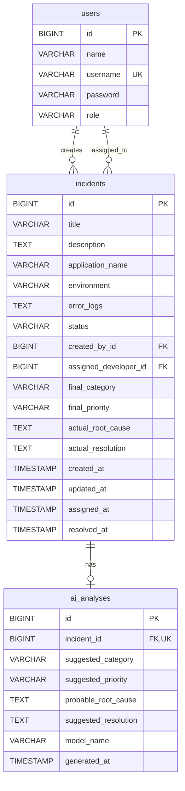

# Database Design

## Overview

The AI Incident Triage Portal MVP is designed for PostgreSQL using three core tables:

- `users`
- `incidents`
- `ai_analyses`

Primary keys are auto-generated `BIGINT` values. Enums are stored as readable strings rather than numeric values to keep data clear for debugging, reporting, and operational review.

## Entity Relationship Diagram

## Table: `users`

Seeded users support authentication and role-based authorization in the MVP.

| Column | Type | Constraints | Notes |
| --- | --- | --- | --- |
| `id` | `BIGINT` | Primary key, auto-generated | Internal numeric identifier |
| `name` | `VARCHAR(100)` | Nullable allowed by design unless implementation chooses otherwise | Display name |
| `username` | `VARCHAR(50)` | Unique, not null | Login identifier |
| `password` | `VARCHAR(255)` | Not null | BCrypt hash |
| `role` | `VARCHAR(30)` | Not null | `SUPPORT_ENGINEER` or `DEVELOPER` |

## Table: `incidents`

The `incidents` table stores the original support intake, assignment state, developer review fields, and resolution outcome.

| Column | Type | Constraints | Notes |
| --- | --- | --- | --- |
| `id` | `BIGINT` | Primary key, auto-generated | UI may display as `INC-0042` |
| `title` | `VARCHAR(150)` | Not null | Incident title |
| `description` | `VARCHAR(2000)` or `TEXT` with validation | Not null | Incident description |
| `application_name` | `VARCHAR(50)` | Not null | Fixed enum value |
| `environment` | `VARCHAR(20)` | Not null | Fixed enum value |
| `error_logs` | `VARCHAR(10000)` or `TEXT` with validation | Nullable | Optional plain text logs |
| `status` | `VARCHAR(30)` | Not null | `OPEN`, `IN_PROGRESS`, `RESOLVED` |
| `created_by_id` | `BIGINT` | Not null, foreign key to `users.id` | Creator support engineer |
| `assigned_developer_id` | `BIGINT` | Nullable, foreign key to `users.id` | Assigned developer |
| `final_category` | `VARCHAR(50)` | Nullable until resolution | Final human decision |
| `final_priority` | `VARCHAR(20)` | Nullable until resolution | Final human decision |
| `actual_root_cause` | `VARCHAR(2000)` or `TEXT` with validation | Nullable until resolution | Developer-entered root cause |
| `actual_resolution` | `VARCHAR(3000)` or `TEXT` with validation | Nullable until resolution | Developer-entered resolution |
| `created_at` | `TIMESTAMP` | Not null | Set on creation |
| `updated_at` | `TIMESTAMP` | Not null | Updated on mutation |
| `assigned_at` | `TIMESTAMP` | Nullable until assignment | Set when assigned |
| `resolved_at` | `TIMESTAMP` | Nullable until resolution | Set when resolved |

Relationship and lifecycle rules:

- `created_by_id` is mandatory.
- `assigned_developer_id` is nullable until assignment.
- Developer review fields are nullable until resolution.
- Assignment and resolution timestamps are nullable until those actions occur.
- Deleting a user must not cascade delete incidents.
- Direct transition from `OPEN` to `RESOLVED` is not allowed.
- Resolved incidents cannot be edited or analysed.

## Table: `ai_analyses`

The `ai_analyses` table stores the original read-only AI triage output separately from the developer's final resolution fields.

| Column | Type | Constraints | Notes |
| --- | --- | --- | --- |
| `id` | `BIGINT` | Primary key, auto-generated | Internal numeric identifier |
| `incident_id` | `BIGINT` | Unique, not null, foreign key to `incidents.id` | One analysis per incident |
| `suggested_category` | `VARCHAR(50)` | Not null | Fixed category enum value |
| `suggested_priority` | `VARCHAR(20)` | Not null | Fixed priority enum value |
| `probable_root_cause` | `VARCHAR(2000)` or `TEXT` with validation | Not null | AI-generated root cause |
| `suggested_resolution` | `VARCHAR(3000)` or `TEXT` with validation | Not null | AI-generated resolution |
| `model_name` | `VARCHAR(100)` | Not null | OpenAI model identifier |
| `generated_at` | `TIMESTAMP` | Not null | Generated timestamp |

Rules:

- `incident_id` references `incidents.id`.
- `incident_id` is unique.
- An AI analysis cannot exist without an incident.
- Cascade deletion from an incident to its AI analysis is acceptable.
- Each incident can have at most one AI analysis.
- AI analysis remains read-only after generation.

## Indexes

| Index | Purpose |
| --- | --- |
| Unique index on `users.username` | Enforce unique login identifiers |
| Unique index on `ai_analyses.incident_id` | Enforce one AI analysis per incident |
| Index on `incidents.status` | Support filtering by workflow state |
| Index on `incidents.created_by_id` | Support creator-based authorization and lookups |
| Index on `incidents.assigned_developer_id` | Support assignment-based authorization and lists |
| Index on `incidents.created_at` | Support newest-first incident lists |

## Controlled Values

### User Roles

- `SUPPORT_ENGINEER`
- `DEVELOPER`

### Incident Statuses

- `OPEN`
- `IN_PROGRESS`
- `RESOLVED`

### Application Names

- `AUTH_SERVICE`
- `PAYMENT_SERVICE`
- `ORDER_SERVICE`
- `NOTIFICATION_SERVICE`
- `REPORTING_SERVICE`

### Environments

- `DEV`
- `QA`
- `UAT`
- `PROD`

### Categories

- `API`
- `DATABASE`
- `AUTHENTICATION`
- `DEPLOYMENT`
- `PERFORMANCE`
- `NETWORK`
- `INTEGRATION`
- `CONFIGURATION`
- `OTHER`

### Priorities

- `LOW`
- `MEDIUM`
- `HIGH`
- `CRITICAL`
