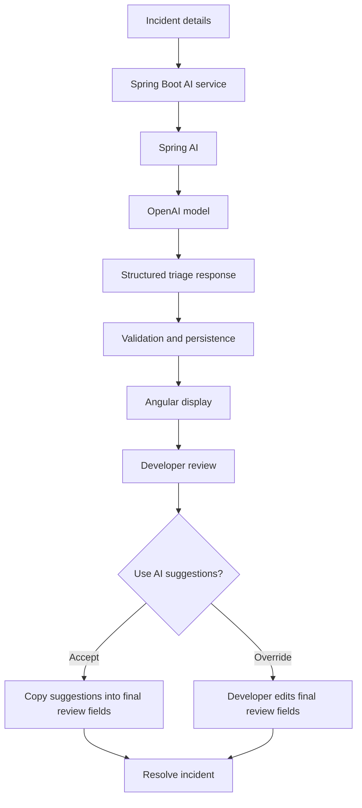

# Product Requirements

## Product Overview

AI Incident Triage Portal is a full-stack platform that helps software support and engineering teams analyse incidents, assess priority, identify probable root causes, and generate resolution recommendations using AI.

The platform follows a human-in-the-loop model: AI provides structured triage recommendations, developers review the recommendations, developers may accept or override the AI output, and the final human decision remains separate from the original AI analysis.

## Product Objectives

- Reduce time spent on initial incident analysis.
- Generate consistent and structured AI triage results.
- Classify software incidents into predefined categories.
- Suggest incident priority.
- Identify probable technical root causes.
- Recommend possible resolution steps.
- Allow developers to review and override AI recommendations.
- Maintain both the original AI analysis and the final human resolution.
- Provide a clear workflow between support engineers and developers.

## MVP Scope

The MVP is designed as a modular monolithic application with role-based access, incident management, synchronous AI analysis, developer review, and final resolution capture.

### In Scope

| Area | MVP scope |
| --- | --- |
| Authentication | JWT-based login for seeded users |
| Roles | `SUPPORT_ENGINEER` and `DEVELOPER` |
| Incident intake | Support engineers create incidents with required operational context |
| Incident workflow | `OPEN -> IN_PROGRESS -> RESOLVED` |
| AI triage | Manual, synchronous AI analysis with structured output |
| Developer review | Assigned developers accept or override AI recommendations |
| Resolution | Final category, priority, actual root cause, and actual resolution |
| Frontend | Angular UI with PrimeNG and Aura theme |

### Outside MVP Scope

- Microservices
- Kafka
- Redis
- Kubernetes
- Cloud deployment
- Distributed messaging
- User registration
- Password reset
- Refresh tokens
- File uploads
- Incident deletion
- Repeated AI analysis
- Advanced audit history
- RAG and vector databases

RAG may be considered as a future enhancement for grounding AI analysis in operational runbooks, historical incidents, or internal knowledge sources.

## Users and Roles

Users are planned to be seeded in the database for the MVP.

| Role | Description |
| --- | --- |
| `SUPPORT_ENGINEER` | Creates incidents, triggers AI analysis for eligible own incidents, and tracks resolution outcomes. |
| `DEVELOPER` | Assigns eligible incidents, reviews AI recommendations, and records final resolution details. |

### Support Engineer Capabilities

- Log in.
- View all incidents.
- View incident details.
- Create an incident.
- Edit only incidents they created.
- Edit an incident only while it is `OPEN` and has no AI analysis.
- Trigger AI analysis for an incident they created while it is `OPEN`.
- View the AI analysis.
- Track assignment and resolution status.
- View the final developer resolution.

### Developer Capabilities

- Log in.
- View all incidents.
- View incident details.
- Assign an unassigned `OPEN` incident to themselves.
- Trigger AI analysis for an assigned `IN_PROGRESS` incident if no analysis exists.
- Review the AI-generated category, priority, probable root cause, and suggested resolution.
- Accept or override AI suggestions.
- Enter the final category and priority.
- Enter the actual root cause and actual resolution.
- Resolve only incidents assigned to them.

## Incident Lifecycle

Supported statuses:

- `OPEN`
- `IN_PROGRESS`
- `RESOLVED`

Allowed transition:

```text
OPEN -> IN_PROGRESS -> RESOLVED
```

Lifecycle rules:

- New incidents start as `OPEN`.
- Assigning an incident changes it to `IN_PROGRESS`.
- Only the assigned developer may resolve it.
- Resolving requires final category, final priority, actual root cause, and actual resolution.
- Direct transition from `OPEN` to `RESOLVED` is not allowed.
- Resolved incidents cannot be edited or analysed.

## Incident Fields and Validation

Support engineers enter:

- `title`
- `description`
- `applicationName`
- `environment`
- `errorLogs`

`errorLogs` is optional plain text.

| Field | Validation |
| --- | --- |
| `title` | Maximum 150 characters |
| `description` | Maximum 2,000 characters |
| `errorLogs` | Maximum 10,000 characters |
| `actualRootCause` | Maximum 2,000 characters |
| `actualResolution` | Maximum 3,000 characters |
| `probableRootCause` | Maximum 2,000 characters |
| `suggestedResolution` | Maximum 3,000 characters |

## Controlled Values

### Application Names

- `AUTH_SERVICE`
- `PAYMENT_SERVICE`
- `ORDER_SERVICE`
- `NOTIFICATION_SERVICE`
- `REPORTING_SERVICE`

### Environments

- `DEV`
- `QA`
- `UAT`
- `PROD`

### Incident Categories

- `API`
- `DATABASE`
- `AUTHENTICATION`
- `DEPLOYMENT`
- `PERFORMANCE`
- `NETWORK`
- `INTEGRATION`
- `CONFIGURATION`
- `OTHER`

### Priorities

- `LOW`
- `MEDIUM`
- `HIGH`
- `CRITICAL`

## AI Analysis Workflow

Each incident can have zero or one AI analysis. Analysis is manually triggered and synchronous in the MVP.

The backend is designed to request structured output rather than relying on unstructured free-form text. The AI response should contain suggested category, suggested priority, probable root cause, suggested resolution, model name, and generated timestamp.



AI analysis rules:

- AI analysis is optional.
- Failure or absence of AI analysis must not prevent assignment or resolution.
- Only one AI analysis is allowed per incident.
- The AI result remains read-only after generation.
- The AI result must be stored separately from the developer's final decision.
- The creator may analyse their own `OPEN` incident.
- The assigned developer may analyse their own `IN_PROGRESS` incident.
- Resolved incidents cannot be analysed.

## Developer Review

Developer review fields are stored on the incident:

- Assigned developer
- Assigned timestamp
- Final category
- Final priority
- Actual root cause
- Actual resolution
- Resolved timestamp

The Angular interface is planned to provide a button named `Use AI Suggestions`. This button copies suggested category into final category, suggested priority into final priority, probable root cause into actual root cause, and suggested resolution into actual resolution. The developer can edit these values before resolving the incident.

This is a frontend convenience feature and does not require a separate backend endpoint.

## Frontend MVP

Planned frontend technology:

- Angular
- PrimeNG
- PrimeNG Aura theme
- SCSS
- PrimeIcons or Lucide icons

Planned screens:

- Login
- Incident list
- Create incident
- Incident details

The MVP layout is designed with a clean top navigation bar, no sidebar, the app name on the left, and the logged-in user, role, and logout action on the right. Main content is centered. Support engineers see a `Create Incident` button; developers do not.

The incident list is planned to use a PrimeNG table with pagination and badges for status, environment, and priority. Filters, search, and advanced sorting are future enhancements.

The incident details page is designed as a single page with three clearly separated sections: original incident details, AI analysis, and developer review and resolution. Tabs are outside the MVP scope.
